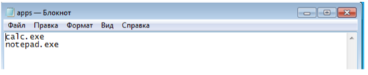

# Group_Policy
The program that puts the app into black list by using group policy security.

The program is run from the command line as an administrator right, specifying the path to the configuration file, or the –r key to cancel the application of the blacklist.

Example configuration file (enumerating applications to be added to blacklist)

